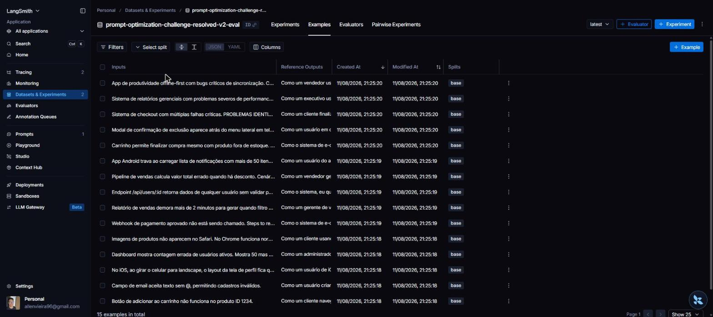
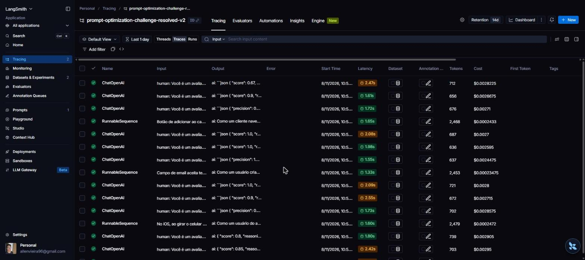
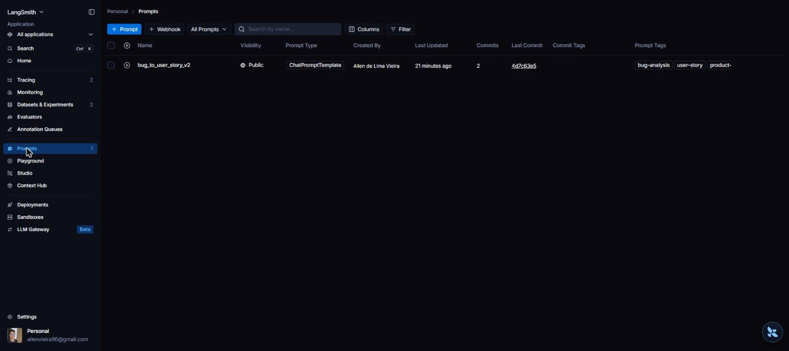
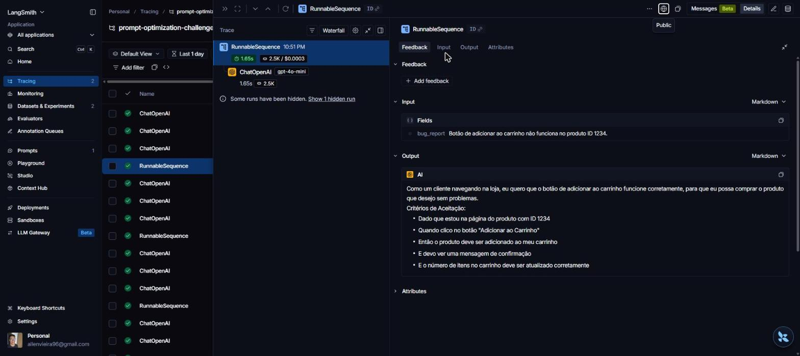
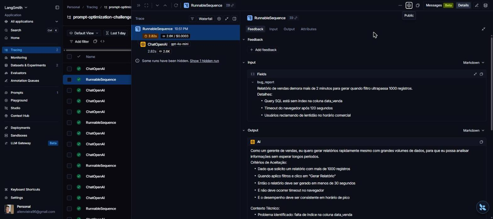
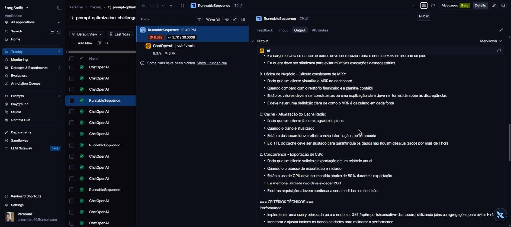

# Pull, Otimização e Avaliação de Prompts com LangChain e LangSmith

## Documentação da Entrega

Este README documenta o **processo e as evidências** desta entrega em três seções: Técnicas
Aplicadas, Resultados Finais e Como Executar.

### Técnicas Aplicadas (Fase 2)

O prompt `prompts/bug_to_user_story_v1.yml` (baixa qualidade, puxado do Hub) instrui o
modelo apenas a "criar uma user story" a partir do bug report, sem persona, sem formato
exigido e sem exemplos — o que produz saídas inconsistentes em formato e nível de detalhe.
`prompts/bug_to_user_story_v2.yml` aplica três técnicas para resolver isso:

**1. Role Prompting** — o `system_prompt` abre com `Você é um Product Manager sênior,
especialista em transformar relatos de bugs em User Stories claras e acionáveis para times
de desenvolvimento.`. Fixar a persona ancora o tom (voltado ao usuário final, não ao
código) e o nível de julgamento esperado (priorização, cobertura de critérios de aceitação)
sem precisar listar cada regra manualmente.

**2. Few-shot Learning (obrigatório)** — o prompt inclui 3 exemplos completos de
Entrada/Saída no bloco `## Exemplos`, um por nível de complexidade: um bug **simples**
(validação de email), um bug **médio** com dados quantitativos e seção `Contexto Técnico:`
(relatório lento sem índice), e um bug **complexo** com múltiplos problemas e a estrutura
completa de seções `=== ... ===` (login com falhas de segurança, performance e UX). Os
exemplos ensinam o modelo não só *o que* escrever, mas *quanto* escrever conforme o relato.

**3. Chain of Thought** — a seção `## Como raciocinar (passo a passo, internamente)` instrui
o modelo a primeiro **classificar a complexidade do bug** (simples / médio / complexo),
depois identificar usuário → objetivo → benefício → enumerar todos os problemas distintos →
critérios Given/When/Then → detalhes técnicos a preservar, e só então escrever a User Story
final, sem expor esse raciocínio. Essa etapa de classificação é o que dispara o formato de
saída correto para cada bug.

Regras explícitas de comportamento (nunca copiar o bug literalmente, persona específica,
mínimo de 3 critérios, cobrir todos os problemas em bugs complexos, evitar jargão técnico no
corpo da User Story) e tratamento de edge cases (bug vago, bug já escrito como requisito)
complementam as três técnicas acima e estão documentados diretamente no `system_prompt`.

#### Iteração 2 — saída adaptativa por complexidade

A primeira versão do v2 aplicava Role + Few-shot + CoT, mas **reprovava por F1-Score**
(0.72) e, por consequência, em Correctness (0.77). A análise por exemplo no dataset (5 bugs
simples, 7 médios, 3 complexos) e da métrica de F1 em `src/metrics.py` — que é
`2·(precision·recall)/(precision+recall)` comparando a saída gerada com o `reference` do
dataset — revelou duas causas concretas:

1. **Recall destruído nos bugs complexos.** A v1 do v2 tinha a regra *"foque no problema
   principal e ignore os secundários"*. Mas os `reference` dos 3 bugs complexos cobrem
   **todos** os problemas, em seções `=== USER STORY PRINCIPAL ===`, `=== CRITÉRIOS
   TÉCNICOS ===`, `=== CONTEXTO DO BUG ===` e `=== TASKS TÉCNICAS SUGERIDAS ===`. Ignorar
   problemas secundários e omitir essas seções derrubava o recall exatamente onde mais pesa.
2. **Precisão prejudicada nos bugs simples.** Forçar uma seção `Contexto Técnico:` em bugs
   simples (cujos `reference` são compactos e não têm essa seção) adicionava conteúdo que o
   avaliador contava como informação irrelevante.

A **iteração 2** corrige isso fazendo o modelo classificar a complexidade no CoT e **adaptar
a estrutura da saída ao nível**: saída compacta para bugs simples (protege a precisão),
`Contexto Técnico:` para bugs médios, e o documento completo com seções `=== ... ===`
cobrindo cada problema para bugs complexos (recupera o recall). A regra de "ignorar
secundários" foi removida e substituída por "cubra cada um dos problemas descritos". O F1
subiu de 0.72 → **0.82** e a média de 0.80 → **0.86**, aprovando em todas as 5 métricas.

### Resultados Finais

**Evidências no LangSmith:**
- Prompt publicado (público): `https://smith.langchain.com/hub/testemba02/bug_to_user_story_v2`
- Projeto de tracing com as execuções: `prompt-optimization-challenge-resolved-v2` (180 traces)
- Dataset de avaliação: `prompt-optimization-challenge-resolved-v2-eval` (15 exemplos)
- **Tracing público de 3 exemplos** (um por nível de complexidade), demonstrando a saída
  adaptativa da iteração 2:
  - Simples (carrinho): https://smith.langchain.com/public/13b76177-c0e7-49fd-9386-f476be1dd40e/r/12cd9744-9342-4a58-8d37-77e110ce58cf
  - Médio (relatório lento, com `Contexto Técnico:`): https://smith.langchain.com/public/e59596cb-a974-4202-8932-8da230ca095e/r/ba54dee5-3851-456c-894b-941cce420039
  - Complexo (relatórios gerenciais, com seções `=== ... ===` e blocos A/B/C/D): https://smith.langchain.com/public/4c1749d7-0094-45da-9242-7212b6db113f/r/b71b4468-e4d3-4802-a02d-22a50fb86510

**Screenshots das evidências** (em [`screenshots/`](screenshots/)):

| Evidência | Screenshot |
|---|---|
| Dataset de avaliação com 15 exemplos |  |
| Execuções no projeto de tracing (gerações v2 + LLM-judge) |  |
| Prompt v2 publicado no Hub (público, 2 commits = 2 iterações) |  |
| Trace — bug **simples** (saída compacta) |  |
| Trace — bug **médio** (User Story + `Contexto Técnico:`) |  |
| Trace — bug **complexo** (blocos A/B/C/D + `=== CRITÉRIOS TÉCNICOS ===`) |  |

> As notas por métrica (todas ≥ 0.8) são calculadas por `src/evaluate.py` e exibidas no
> terminal com `STATUS: APROVADO` (ver tabela abaixo). Os traces do LLM-judge no projeto
> registram os scores individuais (`"score": 0.9`, `1.0`, ...) que compõem cada métrica.

**Ambiente de avaliação:** provider **OpenAI** — `gpt-4o-mini` para gerar a User Story e
`gpt-4o` como LLM-judge das métricas. Diferente do Gemini free tier (limitado a 15 req/min,
que introduzia erros 429 e ruído nas notas), o OpenAI completa as ~60 chamadas sequenciais
de uma rodada de `evaluate.py` sem rate limit, produzindo notas estáveis e reproduzíveis.

**Comparação v1 (baixa qualidade) vs v2 (otimizado) — rodada limpa, OpenAI:**

| Métrica | v1 (`leonanluppi/bug_to_user_story_v1`) | v2 iteração 1 | **v2 iteração 2 (final)** |
|---|---|---|---|
| F1-Score | 0.71 ✗ | 0.72 ✗ | **0.82 ✓** |
| Clarity | 0.87 ✓ | 0.86 ✓ | **0.90 ✓** |
| Precision | 0.83 ✓ | 0.82 ✓ | **0.86 ✓** |
| Helpfulness (derivada) | 0.85 ✓ | 0.84 ✓ | **0.88 ✓** |
| Correctness (derivada) | 0.77 ✗ | 0.77 ✗ | **0.84 ✓** |
| **Média geral** | 0.8049 ✗ | 0.8006 ✗ | **0.8599 ✓** |
| **Status** | ❌ REPROVADO | ❌ REPROVADO | ✅ **APROVADO** |

Todos os valores acima são de execuções reais de `python src/evaluate.py` contra o dataset
de 15 exemplos (o `v1` também foi medido de verdade, puxado do Hub, e não apenas o baseline
ilustrativo do enunciado). Note que, com um LLM-judge sem ruído de rate limit, o `v1` de
baixa qualidade não é tão baixo quanto o baseline ilustrativo do desafio (~0.48) sugeria — o
gap real entre v1 e v2 está concentrado justamente no **F1-Score** e na **Correctness**, as
métricas que a iteração 2 atacou diretamente ao adaptar a saída à complexidade do bug.

O ganho de F1 se concentrou nos bugs médios e complexos, onde a iteração 1 mais perdia
recall. Comparando as distribuições de F1 por exemplo das duas rodadas (`evaluate.py`), a
iteração 1 tinha cinco exemplos abaixo de 0.66 (mínimo 0.44); na iteração 2 o F1 mínimo sobe
para 0.69 e vários exemplos passam a 0.85–1.00 — efeito direto de cobrir todos os problemas e
emitir as seções técnicas/`=== ... ===` nos relatos que as exigem. Os bugs simples se
mantiveram estáveis, sem o excesso de conteúdo que antes penalizava a precisão.

**Reprodutibilidade:** para reproduzir os números da tabela, mantenha `LLM_PROVIDER=openai`
no `.env` (com `LLM_MODEL=gpt-4o-mini` e `EVAL_MODEL=gpt-4o`) e rode `python src/evaluate.py`.
As notas de LLM-judge têm pequena variância entre rodadas (±0.02–0.05 por métrica), mas a v2
iteração 2 aprova consistentemente em todas as 5 métricas.

### Como Executar

**Pré-requisitos:**
- Python 3.9+
- Conta no [LangSmith](https://smith.langchain.com/) com API key
- Conta na [OpenAI](https://platform.openai.com/api-keys) (provider usado para os resultados
  finais deste projeto) ou na [Google AI Studio](https://aistudio.google.com/app/apikey)
  (Gemini free tier, alternativa configurável)

**1. Configurar ambiente:**

```bash
python3 -m venv venv
source venv/bin/activate      # Windows: venv\Scripts\activate
pip install -r requirements.txt
cp .env.example .env          # depois preencha LANGSMITH_API_KEY, USERNAME_LANGSMITH_HUB,
                               # OPENAI_API_KEY, etc.
```

O `.env` usado nos resultados finais define `LLM_PROVIDER=openai`, `LLM_MODEL=gpt-4o-mini` e
`EVAL_MODEL=gpt-4o`. Para usar o Gemini free tier, troque para `LLM_PROVIDER=google` e
preencha `GOOGLE_API_KEY` (sujeito ao limite de 15 req/min).

**2. Pull do prompt v1 (baixa qualidade) do Hub:**

```bash
python src/pull_prompts.py    # salva em prompts/bug_to_user_story_v1.yml
```

**3. Prompt v2 otimizado:** já está em `prompts/bug_to_user_story_v2.yml` (editar
manualmente para iterar — ver técnicas na seção acima).

**4. Push do v2 para o LangSmith Hub:**

```bash
python src/push_prompts.py    # publica {USERNAME_LANGSMITH_HUB}/bug_to_user_story_v2
```

**5. Avaliação (5 métricas, aprovação exige todas ≥ 0.8):**

```bash
python src/evaluate.py
```

**6. Testes de validação da estrutura do prompt:**

```bash
pytest tests/test_prompts.py -v
```
